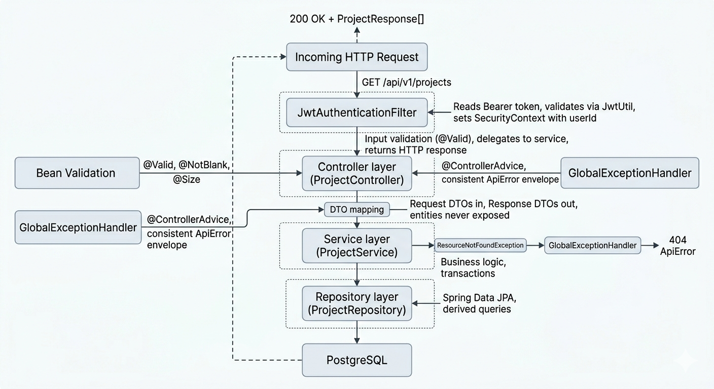
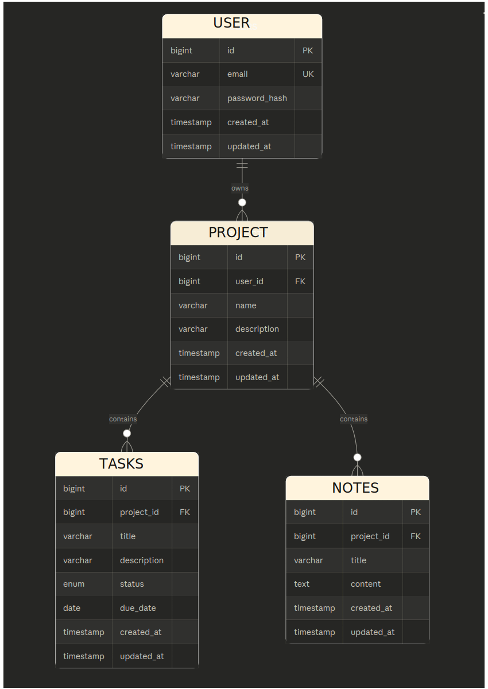

Architecture · MD
# System Architecture

## Overview

Neura is a full-stack productivity app. The backend is a REST API in Spring Boot, the frontend is a React SPA, and they talk over HTTP through an Nginx reverse proxy. The frontend never touches the database directly.


The whole stack runs in Docker containers on a single Azure VM (Standard B2ls_v2, 4GB RAM). Nginx handles SSL termination (Let's Encrypt), serves the React build as static files, and proxies `/api/v1/*` requests to Spring Boot on port 8080.
 
---

## Backend Layer Structure

The backend follows a standard layered architecture: Controller → Service → Repository. Each layer has one job and doesn't reach past its neighbor.



**Controller** — receives HTTP requests, runs input validation (`@Valid`), delegates to the service, and maps the result to a response DTO. Never contains business logic.

**Service** — where the actual work happens. Ownership checks, transaction boundaries, domain exceptions. This is the layer under test.

**Repository** — Spring Data JPA interfaces. Derived queries like `findAllByUserId()`. No business logic, no custom SQL (so far).

**DTOs** — request and response objects live at the controller boundary. Entities are never serialized directly to the client. Mapping is manual (no MapStruct) — see [ADR-007](./ADR_LOG.md#adr-007--manual-dto-mapping-over-mapstruct).

```
app.neura
├── config/          SecurityConfig, CorsConfig
├── controller/      AuthController, ProjectController, TaskController, NoteController
├── dto/
│   ├── request/     RegisterRequest, LoginRequest, CreateProjectRequest, ...
│   └── response/    AuthResponse, ProjectResponse, TaskResponse, NoteResponse, ApiError
├── entity/          User, Project, Task, Note
├── exception/       GlobalExceptionHandler, EmailAlreadyExistsException, ResourceNotFoundException
├── repository/      UserRepository, ProjectRepository, TaskRepository, NoteRepository
├── security/        JwtUtil, JwtAuthenticationFilter
└── service/         AuthService, ProjectService, TaskService, NoteService
```
 
---

## Database Schema

Four tables. Users own projects, projects contain tasks and notes. Foreign keys enforce referential integrity, and cascade deletes mean removing a project cleans up its tasks and notes automatically.



Task status is an enum: `TODO`, `IN_PROGRESS`, `DONE`.

All tables carry `created_at` and `updated_at` timestamps, managed by JPA lifecycle callbacks (`@PrePersist`, `@PreUpdate`). Schema changes are handled exclusively by Flyway — Hibernate's `ddl-auto` is set to `none`. See [ADR-005](./ADR_LOG.md#adr-005--use-flyway-for-schema-migrations).
 
---

## Security

### Authentication

JWT-based, stateless. No sessions, no cookies.



On registration or login, the server returns a JWT (HS256, 24-hour expiry). The frontend stores it in localStorage and attaches it as a `Bearer` token on every subsequent request.

`JwtAuthenticationFilter` (extends `OncePerRequestFilter`) intercepts all requests to protected endpoints:

1. Reads the `Authorization: Bearer <token>` header
2. Validates and decodes the JWT via `JwtUtil`
3. Looks up the user by email (the JWT subject)
4. Sets `user.getId()` as the principal in Spring's `SecurityContextHolder`

Controllers access the authenticated user via `@AuthenticationPrincipal Long userId`. The filter is registered before `UsernamePasswordAuthenticationFilter` in the security chain, and session management is set to `STATELESS`.

Public endpoints (`/api/v1/auth/**`, `/actuator/**`, `/swagger-ui/**`) are excluded from authentication in `SecurityConfig`.

### Resource Ownership

Every resource endpoint enforces ownership at the service layer, not the controller. The pattern is the same across projects, tasks, and notes:

1. Fetch the resource by ID
2. Check if the owning project/resource belongs to the authenticated user
3. If not, throw `ResourceNotFoundException` (returns 404)

Returning 404 instead of 403 is a deliberate choice — it avoids leaking the existence of other users' resources to someone probing IDs.
 
---

## Error Handling

All errors go through `GlobalExceptionHandler` (`@ControllerAdvice`) and return a consistent `ApiError` envelope:

```json
{
  "status": 409,
  "message": "Email already registered: dev@neura.com",
  "path": "/api/v1/auth/register",
  "timestamp": "2026-03-11 13:42:34"
}
```

No stack traces leak to the client. The mapping:

| Exception | HTTP Status | When |
|---|---|---|
| `EmailAlreadyExistsException` | 409 Conflict | Duplicate registration |
| `ResourceNotFoundException` | 404 Not Found | Resource missing or not owned |
| `MethodArgumentNotValidException` | 400 Bad Request | Bean Validation failure |
| `AuthenticationException` | 401 Unauthorized | Bad credentials |
| Unhandled exceptions | 500 Internal Server Error | Unexpected failures |

**Debugging tip from development:** the response *format* tells you which layer is failing. If the error comes back in Spring Security's default shape (`{ timestamp, status, error, message }`), it's the security filter chain. If it's the `ApiError` envelope above, your code is running but throwing.
 
---

## Architecture Decisions

Decisions are tracked as ADRs in the [Nygard format](https://cognitect.com/blog/2011/11/15/documenting-architecture-decisions). Full records in [ADR_LOG.md](./ADR_LOG.md).

| Decision | Choice | Key Tradeoff |
|---|---|---|
| Auth strategy | JWT stateless, 24hr expiry | Simple and scalable, but can't invalidate tokens server-side without extra infra |
| Database | PostgreSQL 15 | Relational integrity over schema flexibility |
| Migrations | Flyway versioned SQL | Explicit, auditable history; no surprise schema changes on deploy |
| Architecture | Layered (Controller → Service → Repository) | Immediately readable over theoretically pure (e.g. hexagonal) |
| Testing DB | Testcontainers (real Postgres) | Catches dialect issues H2 would miss, but slower startup |
| DTO mapping | Manual | Verbose but explicit — no annotation processor magic to debug |
 
---

## Known Gaps & Future Work

These are things I intentionally skipped for the MVP, not things I forgot about:

- **Refresh tokens** — currently users re-auth every 24 hours. Adding rotation would require token storage and revocation logic. See [ADR-004](./ADR_LOG.md#adr-004--no-refresh-tokens-for-mvp).
- **Pagination** — list endpoints return everything. Fine for a demo with <100 items, but wouldn't scale. Would add `?page=0&size=20&sort=createdAt,desc`.
- **Rate limiting** — auth endpoints are currently unprotected against brute force. Would add a simple in-memory rate limiter or Spring Boot Bucket4j.
- **Token blocklist for logout** — since JWTs are stateless, "logout" currently just clears the token client-side. A Redis blocklist would allow real server-side invalidation.
- **Role-based access control** — not needed while it's single-user, but would be the first thing to add for collaboration features.